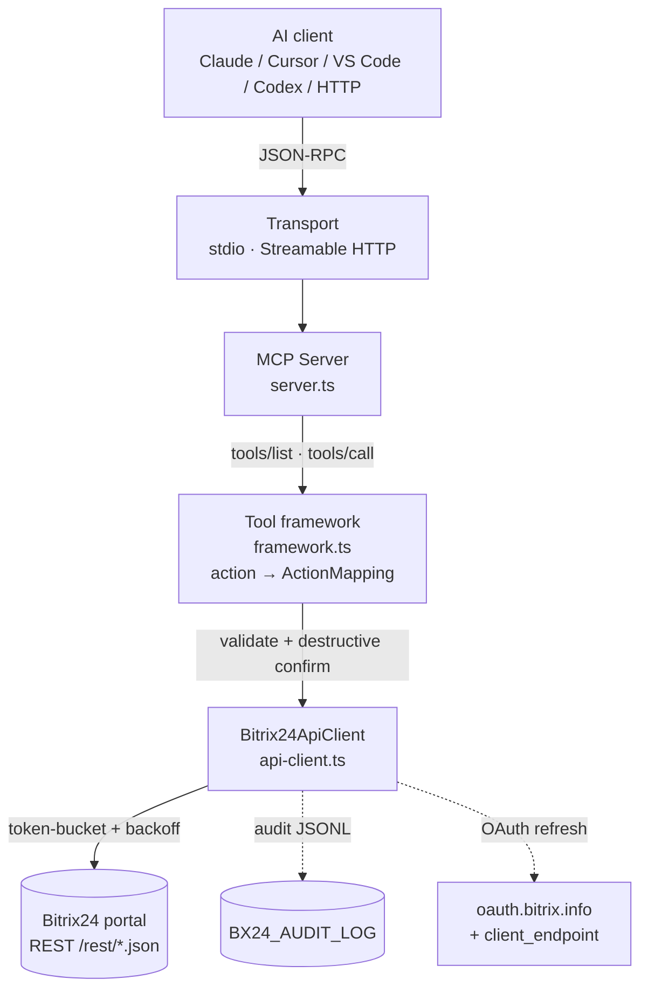

# mcp-b24 — Documentation

Full MCP server over the Bitrix24 REST API: **43 tools**, ~870 actions, webhook + OAuth 2.0, RU/EN, MIT.

**Languages:** English · [Русский](./ru/README.md)

## Architecture



## Documentation by audience

| Document | Audience | Purpose |
|---|---|---|
| [USER_GUIDE.md](./en/USER_GUIDE.md) | Everyday employees | Install, talk to the agent, everyday cases |
| [SELLER_GUIDE.md](./en/SELLER_GUIDE.md) | CRM managers / ROP / HR / admins | Role-specific workflows & recipes |
| [DEVELOPER_GUIDE.md](./en/DEVELOPER_GUIDE.md) | Developers | Architecture, data-driven framework, adding tools, tests, publish |
| [TOOLS_REFERENCE.md](./en/TOOLS_REFERENCE.md) | Everyone | Full registry of 43 tools and actions |
| [AUDIT_LOG.md](./en/AUDIT_LOG.md) | Admins / security | JSONL audit format & policy |

Russian versions: [`ru/`](./ru/README.md).

## Quick start

```bash
npm install -g mcp-b24
export BX24_WEBHOOK_URL="https://YOUR_PORTAL.bitrix24.ru/rest/1/SECRET/"
npx -y mcp-b24
```

Client configs (Claude Desktop, Cursor, VS Code, Codex CLI, Cline/Roo, Docker, HTTP) — see the root [README](../README.md).