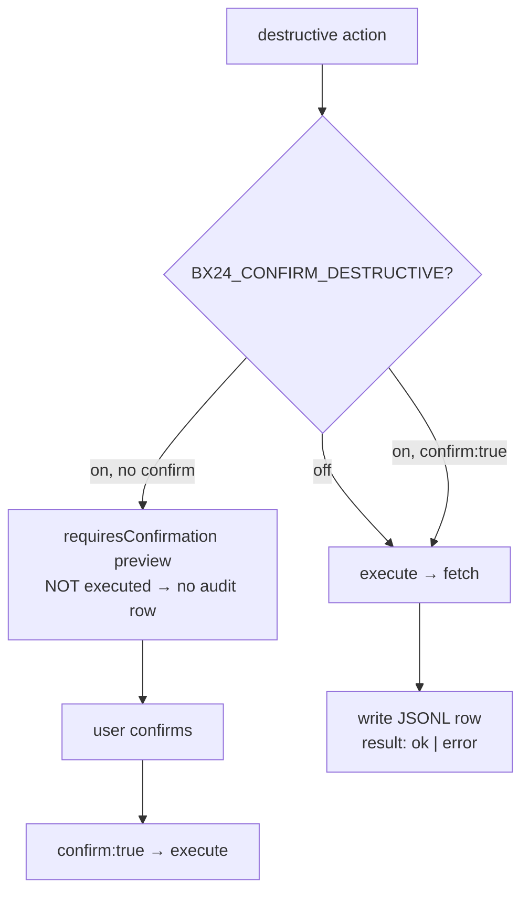

# Audit Log

## Where it lives

The path is set by the `BX24_AUDIT_LOG` environment variable (disabled by default). Recommended: `./audit.log` or a path in a protected directory. When the variable is omitted, auditing is a no-op.

## What is written

- All destructive actions (flagged `destructive` or containing keywords: delete/remove/complete/leave/kick/cancel/stop/close/mute/unbind/clear/markDeleted/kill).
- Auth events: `auth.refresh` (ok/error), `auth.failed`.

## Audit flow



## Format — JSONL, one line per operation

```json
{"ts":"2026-08-24T15:42:18.123Z","tool":"bx24_crm_companies","action":"delete","restMethod":"crm.company.delete","params":{"id":"421"},"result":"ok","durationMs":312}
{"ts":"2026-08-24T15:43:01.000Z","tool":"auth","action":"refresh","restMethod":"oauth/token","result":"ok"}
```

Fields:
- `ts` — ISO-8601 timestamp.
- `tool` — MCP tool name (`bx24_*`) or `auth`.
- `action` — action (for auth — `refresh`/`failed`).
- `actor` — webhook/OAuth user email (if available).
- `restMethod` — Bitrix24 REST method.
- `params` — call params with secrets masked (keys matching `*secret*|*token*|*password*|*webhook*` become `***`).
- `result` — `ok` | `error` | `denied`.
- `durationMs` — operation duration.
- `requestId` — optional request id.

## Rotation & access

- File should be admins-only (`chmod 600`).
- Recommend external `logrotate` or shipping to a SIEM (ELK / Splunk / Sentry).
- Append-only writes (`AuditLog.write` → `appendFileSync`); write errors never abort the operation (best-effort).

## SIEM integration (example)

```bash
# forward to ELK via filebeat
filebeat.inputs: [{ type: log, paths: ["/var/log/bx24/audit.log"], json: { keys_under_root: true } }]
```

## Policy

- Auditing cannot be disabled for destructive ops once `BX24_AUDIT_LOG` is set.
- Secret masking is mandatory (`maskParams`, `SECRET_RE`).
- With `BX24_CONFIRM_DESTRUCTIVE=true`: the first call returns a `requiresConfirmation` preview and is **not** audited as `ok` (treated as `denied` if not retried); a retry with `confirm:true` executes and is audited as `ok`/`error`.