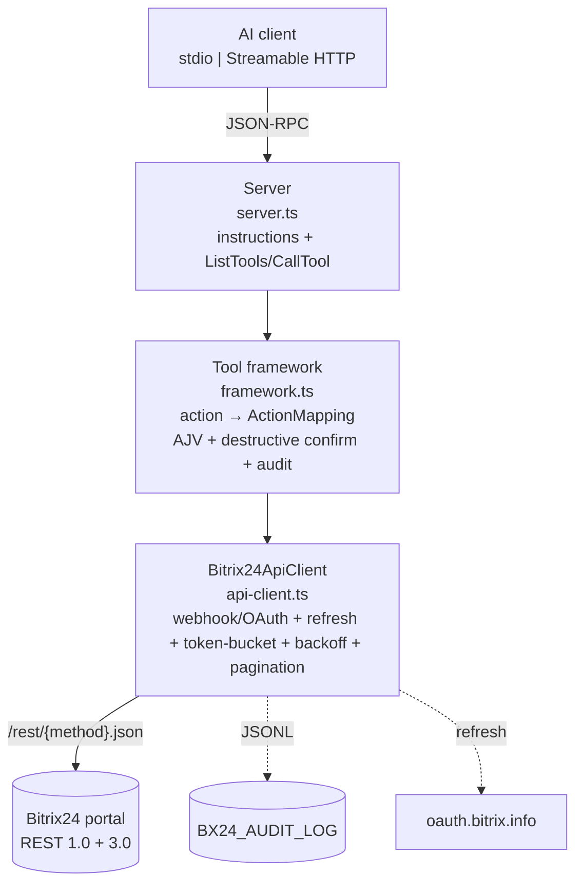
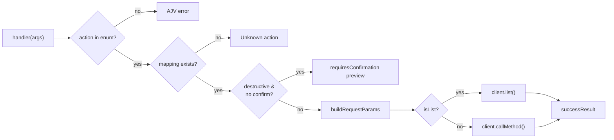
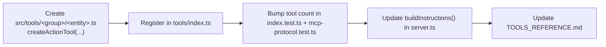
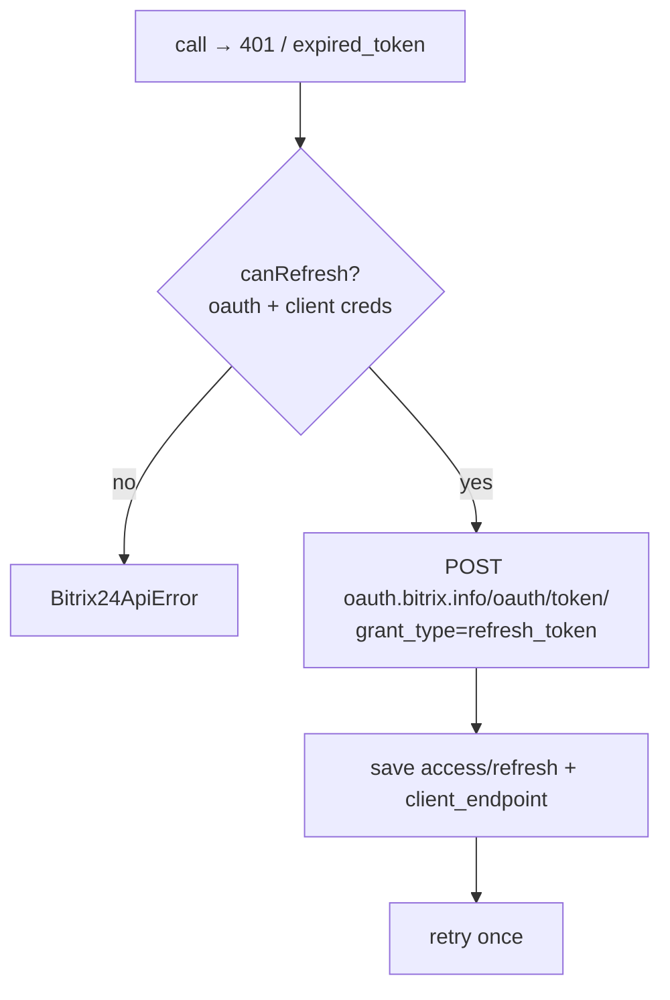
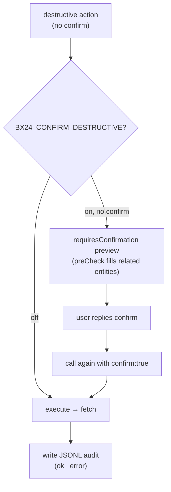

# Developer Guide

Technical guide for contributors and integrators of `mcp-b24`.

## Architecture



Layers are isolated: `api-client` — HTTP/REST only; `framework` — action→request routing, validation, confirmations, audit; tools — declarative mappings; `server` — MCP binding; `transport` — stdio/HTTP.

## Data-driven framework

Each tool is described via `createActionTool(name, description, actionEnum, paramSchema, mappings, client, actionDescriptions, transformResponse?)`. `mappings` maps `action` → `ActionMapping`:

```ts
interface ActionMapping {
  restMethod: string;        // e.g. "crm.lead.add"
  httpVerb?: "GET" | "POST";
  pathParams?: string[];     // logical names; merged into body/request
  queryParams?: string[];
  bodyParam?: string;        // arg → body (with bodyWrapper)
  bodyWrapper?: string;      // wrapper ("fields", "users", ...)
  emptyBody?: boolean;
  rawBody?: boolean;         // all non-reserved args → body as-is
  isList?: boolean;          // call via client.list() with pagination
  destructive?: boolean;    // explicit destructive flag
  preCheck?: (...) => Promise<Record | undefined>;  // two-phase preview
}
```

Request-build rules: `emptyBody` → `{}`; `bodyParam` → `{[wrapper]: body}` + merge `pathParams`; `rawBody` → all args except `action`/`confirm`/`pathParams`; otherwise `pathParams` + `queryParams`.



## Adding a new tool



1. Create `src/tools/<group>/<entity>.ts` and describe the tool via `createActionTool` (template: see `crm/leads.ts`).
2. Register it in `src/tools/index.ts` (`getAllTools`) and update the CRM/collab/org/biz group-count comment.
3. If `restMethod` depends on an argument (e.g. `crm.item.*` with `entityTypeId`) — write a custom tool with its own `handler` (examples: `crm/invoices.ts`, `crm/smartProcesses.ts`); for such tools add their action→restMethod expectations to `CUSTOM_EXPECTED` in `endpoint-coverage.test.ts`.
4. Bump the tool-count assertions in `src/tools/index.test.ts` and `src/mcp-protocol.test.ts` (`toHaveLength`).
5. `endpoint-coverage.test.ts` auto-discovers new framework-tool actions by parsing source — no per-action routing case needed; add one representative case to `index.test.ts` for a fast signal.
6. Update `buildInstructions()` in `src/server.ts` and [TOOLS_REFERENCE.md](./TOOLS_REFERENCE.md) (RU + EN).

## Auth



- **Webhook** (`BX24_MODE=webhook` + `BX24_WEBHOOK_URL`): auth is baked into the URL; the token doesn't expire.
- **OAuth** (`BX24_MODE=oauth` + `BX24_DOMAIN` + client creds): the access token lives ~1 h; on `expired_token`/401 the client POSTs to `{BX24_OAUTH_SERVER}/oauth/token/` (default `https://oauth.bitrix.info`), stores the new access/refresh and `client_endpoint`, and retries once. `client_endpoint` takes priority over `BX24_DOMAIN`.
- Priority: explicit `BX24_MODE`; otherwise auto-detect (webhook, else OAuth).

## Rate-limit & backoff

- **Token-bucket** (`src/utils/tokenBucket.ts`): `BX24_RATE_LIMIT_RPS` (≤2 non-Enterprise, ≤5 Enterprise) + `BX24_RATE_LIMIT_BURST`.
- **503 QUERY_LIMIT_EXCEEDED**: exponential backoff 1→2→4→8→16 s, cap 30 s (`BACKOFF_STEPS_MS`).
- **429 OPERATION_TIME_LIMIT**: pause until `operating_reset_at`, then retry.
- **Batch** (`bx24_batch`): up to 50 commands; each nested call counts toward the RPS limit.

## Destructive actions & audit



- With `BX24_CONFIRM_DESTRUCTIVE=true`, a destructive action without `confirm:true` returns a structured `requiresConfirmation` preview and does **not** execute. `preCheck` (if set) fills the preview with related entities.
- Each executed destructive action is written to `BX24_AUDIT_LOG` (JSONL) via `client.recordDestructive(...)`. Format — see [AUDIT_LOG.md](./AUDIT_LOG.md).
- Secrets are masked in params (`SECRET_RE`).

## Localization

- Strings live in `src/i18n/{ru,en}.ts` (typed `Dict`, key parity). Switch — `BX24_DEFAULT_LANG` (`ru`/`en`), default `ru`.
- `t(lang, key, vars)` is used by the framework and api-client for messages.

## Testing (Vitest)

```bash
npm test                 # 95 tests, 8 files
npm run test:coverage
```

Coverage: `config.test`, `api-client.test` (webhook/OAuth URL, auto-refresh, client_endpoint, 503 backoff, errors-in-200 body, pagination), `framework.test` (routing, bodyWrapper, rawBody, destructive confirm), `validate.test`, `tools/index.test` (43 tools + action↔mappings parity — every action resolves), `tools/summary-health.test` (CRM summary aggregation + health check), `tools/endpoint-coverage.test` (parses source mappings + instruments fetch to verify every one of the 872 action→REST-method routings), `mcp-protocol.test` (InMemoryTransport + Client: listTools(43), calls).

## Build & publish

```bash
npm run build        # tsc → dist/
npm version patch|minor|major
npm publish --access public   # prepublishOnly: clean → build → test
```

SemVer: MAJOR — breaking schema/action renames; MINOR — new tools/actions; PATCH — bugfixes.

## Docker / CI

- Multi-stage `Dockerfile` (node:20-alpine); `docker-compose.yml` for HTTP.
- CI: lint + test + build on Node 18/20/22, npm release on `v*` tag (configure in GitHub Actions).

## Security

- Never log secrets (`SECRET_RE` masking; `maskParams` in `framework.ts` is deep and shared by `bx24_call`/`bx24_batch` audit entries).
- `.env` in `.gitignore`; never commit `.env` with real tokens.
- HTTP transport hardening lives in `transport.ts`: CORS is opt-in (`BX24_CORS_ORIGIN`), `Host` headers are validated against local names/IP literals (DNS-rebinding defence), bodies capped at 2 MB, optional `BX24_HTTP_TOKEN` bearer auth. Gateway checks run in order: path → host → preflight → token → size.
- `audit.log` — chmod 600, admins only; recommend shipping to a SIEM.