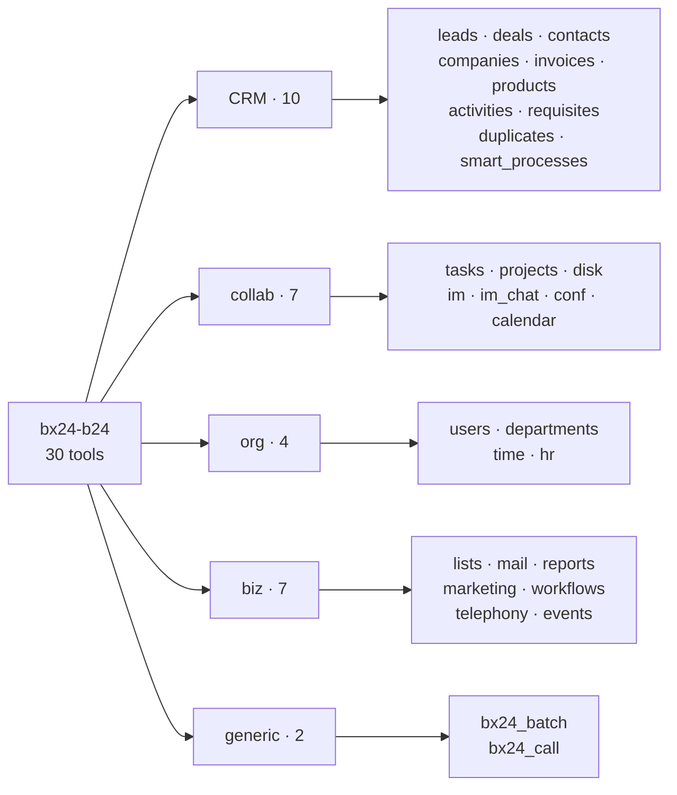

# Tools Reference

Full registry of the 30 `mcp-b24` tools: 28 domain + `bx24_batch` + `bx24_call`. All tools except the two generic ones are **action-based** (the operation is selected via the `action` parameter). Destructive actions are marked 🗑️.

> Exact parameter schemas live in each tool's `inputSchema` (visible to MCP clients via `tools/list`). This is a summary registry.

## Tool groups

## CRM

| Tool | Actions |
|---|---|
| `bx24_crm_leads` | add, get, list, update, 🗑️delete, fields, contact_get/add/🗑️delete, userfield_get/add/update/🗑️delete, convert |
| `bx24_crm_deals` | add, get, list, update, 🗑️delete, fields, category_list/add/update/🗑️delete, getProductRows, 🗑️setProductRows, addProductRow, getContactBindings, setContactBindings, getByCategory, moveToCategory, count |
| `bx24_crm_contacts` | add, get, list, update, 🗑️delete, fields, company_add/🗑️delete/list, userfield_get/add/update/🗑️delete |
| `bx24_crm_companies` | add, get, list, update, 🗑️delete, fields, contact_add/🗑️delete/list, userfield_get/add/update/🗑️delete |
| `bx24_crm_invoices` | add, get, list, update, 🗑️delete, fields, stage_list, getProductRows, 🗑️setProductRows, addProductRow (entityTypeId=31 auto) |
| `bx24_crm_products` | product_add/get/list/update/🗑️delete/fields, section_list/add/get/🗑️delete, price_add/list/update, store_list/get, productrow_add/get/list |
| `bx24_crm_activities` | add, get, list, update, 🗑️delete, fields, complete, timeline_comment, timeline_list, binding_add/🗑️delete, count |
| `bx24_crm_requisites` | add, get, list, update, 🗑️delete, preset_list/get, link_add |
| `bx24_crm_duplicates` | findbycomm, findbyfields, 🗑️merge, 🗑️mergeBatch |
| `bx24_smart_processes` | type_list/get/add/update/🗑️delete, item_list/get/add/update/🗑️delete (item_* require typeId) |

## collab

| Tool | Actions |
|---|---|
| `bx24_tasks` | add, update, get, list, 🗑️delete, start, pause, defer, complete, renew, delegate, approve, disapprove, count, getFields, files_attach, history_list, result_add/list, addToFlow, moveToStage, checklist_add/get/list/update/🗑️delete/complete, comment_add/list/update/🗑️delete, elapsed_add |
| `bx24_projects` | create, get, list, update, 🗑️delete, user_list/add/🗑️delete, set_owner, feature_set/get, request_list |
| `bx24_disk` | storage_list/get/addFolder, folder_addSubFolder/getChildren/copyTo/moveTo/rename/🗑️deleteTree/getExternalLink, file_upload/get/search/copyTo/moveTo/rename/🗑️delete/markDeleted/restore/getVersions/uploadVersion/getExternalLink |
| `bx24_im` | message_add/update/🗑️delete/get, dialog_get/messages_list/read/unread/typing/mark/users, notify_personal_add/system_add/🗑️delete, user_get/list, search_message/user, counters_get, recent_list/pin/unpin/hide, bot_list |
| `bx24_im_chat` | add, get, updateTitle/Color/Avatar, setOwner, user_add/list/🗑️delete, 🗑️leave, mute, sendMessage, editMessage, 🗑️deleteMessage, searchMessages, readAll, uploadFile, getCounters |
| `bx24_conf` | create, get, list, 🗑️delete, join, leave |
| `bx24_calendar` | event_add/get/list/update/🗑️delete/get_nearest, section_list/add/update/🗑️delete, meeting_status_set, resource_list, accessibility_get, settings_get |

## org

| Tool | Actions |
|---|---|
| `bx24_users` | current, get, listByDepartment, search, fields, userfield_get/add/update/🗑️delete, add, update, 🗑️delete |
| `bx24_departments` | get, list, add, update, 🗑️delete, get_all, fields, im_get |
| `bx24_time` | status_open/close/pause/get/update, time_settings |
| `bx24_hr` | employee_list/get, invite, 🗑️dismiss, transfer, info |

## biz

| Tool | Actions |
|---|---|
| `bx24_lists` | list_add/get/update/🗑️delete, field_get/add/update/🗑️delete, element_get/list/add/update/🗑️delete, section_list |
| `bx24_mail` | mailbox_list/get/add/🗑️delete, message_list/get/send/🗑️delete/reply/forward, recipient_list, mailservice_list, filter_add/🗑️delete/list, message_mark |
| `bx24_reports` | deal_pipeline, lead_source, user_activity, task_completion, deal_conversion, funnel_stages |
| `bx24_marketing` | segment_create, segment_add_leads, segment_list, broadcast_send, lead_filter, tradeplatform_list |
| `bx24_workflows` | template_list/get, start, 🗑️kill, task_list/complete/get, robot_list, activity_list/get, instance_list, instance_terminate |
| `bx24_telephony` | externalLine_add/🗑️delete/list, externalCall_register/finish/search, sip_add/🗑️delete/list, call_followup_get, voximplant_info/call_search |
| `bx24_events` | bind, 🗑️unbind, get, offline_list/🗑️clear/execute, get_supported, get_list |

## generic

| Tool | Description |
|---|---|
| `bx24_batch` | Combine up to 50 REST calls in one request; reference earlier results via `$result[key]`. |
| `bx24_call` | Invoke any Bitrix24 REST method by name with arbitrary `params` (escape-hatch). |

## Common parameters glossary

- `id` — entity ID (string).
- `fields` — entity fields object (per Bitrix24 docs; use `action=fields` for the full list).
- `filter`, `select`, `order`, `start` — list-method parameters.
- `confirm: true` — confirm a destructive action (when `BX24_CONFIRM_DESTRUCTIVE=true`).
- UPPER_CASE (`CHAT_ID`, `DIALOG_ID`, `MESSAGE`, `TO`, `ID`, `USERS`, `MESSAGE_ID`) — for IM methods.

## Error reasons glossary

- `QUERY_LIMIT_EXCEEDED` — rate limit hit (auto-retry with backoff).
- `OPERATION_TIME_LIMIT` — operation time limit hit (auto-pause until reset).
- `expired_token` / `invalid_token` / `NO_AUTH_FOUND` — auth issues (auto-refresh in OAuth).
- `AUTH_NOT_CONFIGURED` / `AUTH_REFRESH_FAILED` — OAuth config/refresh.
- `REQUEST_TIMEOUT` — request timeout.
- Others — surfaced as `Bitrix24ApiError` with `reason` = the `error` field from the Bitrix24 response.