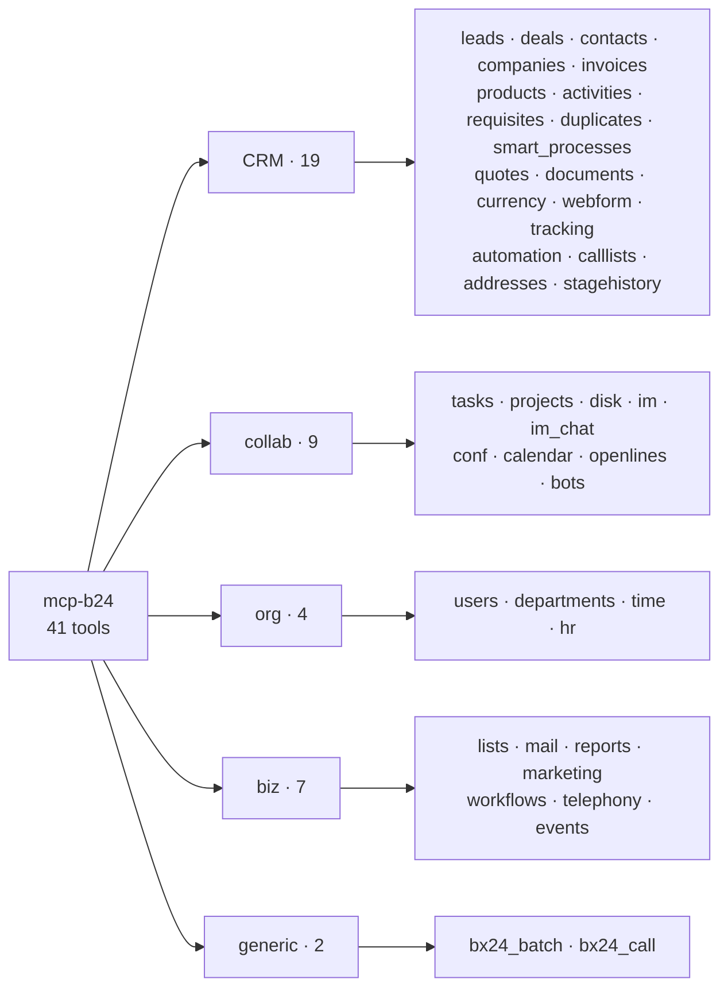

# Tools Reference

Full registry of the 41 `mcp-b24` tools: 39 domain + `bx24_batch` + `bx24_call`. All tools except the two generic ones are **action-based** (the operation is selected via the `action` parameter). Destructive actions are marked 🗑️.

> Exact parameter schemas live in each tool's `inputSchema` (visible to MCP clients via `tools/list`). This is a summary registry.

## Tool groups

## CRM

| Tool | Actions |
|---|---|
| `bx24_crm_leads` | add, get, list, update, 🗑️delete, fields, contact_get/add/🗑️delete/items_set/🗑️items_delete, userfield_get/add/update/🗑️delete, convert, productrows_get/🗑️set, details_get/set/reset |
| `bx24_crm_deals` | add, get, list, update, 🗑️delete, fields, category_list/add/update/🗑️delete, getProductRows, 🗑️setProductRows, addProductRow, getContactBindings, setContactBindings, contact_add/🗑️delete/🗑️items_delete, getByCategory, moveToCategory, count, recurring_add/get/list/update/🗑️delete/expose/fields, details_get/set/reset, userfield_get/add/update/🗑️delete |
| `bx24_crm_contacts` | add, get, list, update, 🗑️delete, fields, company_add/🗑️delete/list/items_set/🗑️items_delete, userfield_get/add/update/🗑️delete, details_get/set/reset |
| `bx24_crm_companies` | add, get, list, update, 🗑️delete, fields, contact_add/🗑️delete/list/items_set/🗑️items_delete, userfield_get/add/update/🗑️delete, details_get/set/reset |
| `bx24_crm_invoices` | add, get, list, update, 🗑️delete, fields, stage_list, getProductRows, 🗑️setProductRows, addProductRow (entityTypeId=31 auto) |
| `bx24_crm_products` | product_add/get/list/update/🗑️delete/fields, section_add/get/list/update/🗑️delete/fields, price_add/get/list/update/🗑️delete/fields, store_add/get/list/update/🗑️delete/fields, productrow_add/get/list, catalog_list/get/isOffers/fields, priceType_*, measure_*, vat_*, ratio_list/fields, roundingRule_*, extra_get/list/fields, storeProduct_*, document_*/document.element_*/documentcontractor_*, property_*/propertyEnum_*/propertyFeature_*/propertySection_*, offer_*, sku_*, service_*, enum_getRoundTypes/getStoreDocumentTypes |
| `bx24_crm_activities` | add, get, list, update, 🗑️delete, fields, complete, count, binding_add/🗑️delete/list/fields, todo_*, configurable_*, type_*, badge_*, timeline_comment_*/timeline_list/note_*/bindings_*/logmessage_*/item_pin/unpin |
| `bx24_crm_requisites` | add, get, list, update, 🗑️delete, fields, preset_list/get/add/update/🗑️delete/countries/fields, bankdetail_*, link_add/register/get/list/unregister/fields, userfield_add/get/list/update/🗑️delete |
| `bx24_crm_duplicates` | findbycomm, findbyfields, 🗑️merge, 🗑️mergeBatch, volatileType_fields/list/register/unregister, status_list/get/add/update/🗑️delete/fields/entity_items/entity_types |
| `bx24_smart_processes` | type_list/get/add/update/🗑️delete, item_list/get/add/update/🗑️delete (item_* require typeId) |
| `bx24_crm_quotes` | add, get, list, update, 🗑️delete, fields, productrows_get/🗑️set, contact_add/🗑️delete/items_get/items_set, userfield_get/add/update/🗑️delete |
| `bx24_crm_documents` | template_list/get/add/update/🗑️delete/fields, document_add/get/list/🗑️delete/fields/enable/disable, binding_add/list/get/🗑️delete/fields, numerator_add/get/list/update/🗑️delete, region_list, provider_list |
| `bx24_crm_currency` | add, get, list, update, 🗑️delete, fields, base_get/set, localizations_get/set/🗑️delete/fields |
| `bx24_crm_webform` | add, get, list, update, 🗑️delete, fields, result_add/list/get/🗑️delete/fields, option_list/add/update/🗑️delete/get |
| `bx24_crm_tracking` | trace_add/get/list/🗑️delete, source_add/get/list/update/🗑️delete, channel_list |
| `bx24_crm_automation` | trigger, trigger_add/list/execute/🗑️delete |
| `bx24_crm_calllists` | add, get, list, 🗑️delete, start, status |
| `bx24_crm_addresses` | add, get, list, update, 🗑️delete, fields, byclient, 🗑️deleteByFilter |
| `bx24_crm_stagehistory` | list, get, fields |

## collab

| Tool | Actions |
|---|---|
| `bx24_tasks` | add, update, get, list, 🗑️delete, start, pause, defer, complete, renew, delegate, approve, disapprove, count, getFields, files_attach, history_list, result_add/list/update/🗑️delete, addToFlow, moveToStage, checklist_add/get/list/update/🗑️delete/complete/moveafteritem/renew, comment_add/list/update/🗑️delete, elapsed_add/update/get/list/🗑️delete, flow_create/get/update/🗑️delete/isExists/activate/pin, stage_add/get/update/🗑️delete/canMoveTask, planner_getList, dependence_add/🗑️delete, userfield_add/update/get/list/🗑️delete |
| `bx24_projects` | create, get, list, update, 🗑️delete, user_list/add/invite/update/🗑️delete, set_owner, feature_set/get, request_list, subject_add/update/🗑️delete |
| `bx24_disk` | storage_list/get/addFolder/getChildren/uploadFile/getTypes/getForApp/fields, folder_addSubFolder/get/getChildren/copyTo/moveTo/rename/🗑️deleteTree/markDeleted/restore/getExternalLink/shareToUser/fields, file_upload/get/search/copyTo/moveTo/rename/🗑️delete/markDeleted/restore/getVersions/uploadVersion/getExternalLink/restoreFromVersion/fields, attachedObject_get, rights_getTasks |
| `bx24_im` | message_add/update/🗑️delete/get/like/share/command, dialog_get/messages_list/messages_search/read/unread/read_all/typing/mark/users, notify_personal_add/system_add/🗑️delete/get/read/read_list/read_all/answer/confirm/history_search, user_get/list/status_set/status_get, search_message/user/chat_list/department_list/last_add/last_get/last_delete, counters_get, recent_list/pin/unpin/hide, department_get/managers_get/employees_get/colleagues_list, v2_file_upload/download, v2_event_subscribe/get/unsubscribe, bot_list |
| `bx24_im_chat` | add, get, updateTitle/Color/Avatar, setOwner, setManager, user_add/list/🗑️delete, 🗑️leave, mute, sendMessage, editMessage, 🗑️deleteMessage, searchMessages, readAll, uploadFile, getCounters |
| `bx24_conf` | create, get, list, 🗑️delete, join, leave |
| `bx24_calendar` | event_add/get/getbyid/list/update/🗑️delete/get_nearest, section_list/add/update/🗑️delete, meeting_status_get/set, resource_list/add/update/🗑️delete/booking_list, accessibility_get, settings_get/set |
| `bx24_openlines` | config_get/list/add/update, session_open/history_get, dialog_get, network_join, operator_answer, message_quick_save, crm_lead_create, crm_message_add |
| `bx24_bots` | bot_register/update/get/list/🗑️unregister, chat_add/get/update/leave/setOwner, chat_user_add/🗑️delete/list, chat_manager_add/🗑️delete, message_send/update/🗑️delete/read/get/getContext, reaction_add/🗑️delete, command_register/update/list/🗑️unregister/answer, file_upload/download, event_get |

## org

| Tool | Actions |
|---|---|
| `bx24_users` | current, get, listByDepartment, search, fields, userfield_get/list/add/update/🗑️delete, add, update, 🗑️delete |
| `bx24_departments` | get, list, add, update, 🗑️delete, get_all, fields, im_get |
| `bx24_time` | status_open/close/pause/get/update, time_settings, timecontrol_report_add/reports_get/settings_get/set/reports_settings_get/reports_users_get, networkrange_get/set/check, schedule_get, record_list/field_list/field_get |
| `bx24_hr` | employee_list/get, invite, 🗑️dismiss, transfer, info |

## biz

| Tool | Actions |
|---|---|
| `bx24_lists` | list_add/get/update/🗑️delete/get_iblock_type_id, field_get/add/update/🗑️delete/type_get, element_get/list/add/update/🗑️delete/get_file_url, section_list/add/update/🗑️delete |
| `bx24_mail` | mailbox_list/get/add/🗑️delete/senders/field_list/field_get, message_list/get/send/🗑️delete/reply/forward/mark/movetofolder/createtask/createcalendarevent/createchat/createfeedpost/createcrmactivity/removecrmactivity/field_list/field_get, recipient_list/listcontacts/listemployees/field_list/field_get, mailservice_list/add/get/🗑️delete/fields, filter_add/🗑️delete/list |
| `bx24_reports` | deal_pipeline, lead_source, user_activity, task_completion, deal_conversion, funnel_stages |
| `bx24_marketing` | segment_create, segment_add_leads, segment_list, broadcast_send, lead_filter, tradeplatform_list |
| `bx24_workflows` | template_list/get/add/update/🗑️delete, start, 🗑️kill, workflow_terminate, task_list/complete/get/delegate, robot_list/add/update/🗑️delete, activity_list/get/add/update/🗑️delete/log, event_send, instance_list/instance_terminate |
| `bx24_telephony` | externalLine_add/🗑️delete/list, externalCall_register/finish/show/hide/attachRecord/search/searchCrmEntities, call_attachTranscription, call_followup_get, voximplant_info/call_search/callback_start/infocall_startwithsound/startwithtext/tts_voices_get/url_get/statistic_get/line_get/line_outgoing_get/set/sip_set/user_get/user_activatePhone, sip_add/update/get/status/connector_status/🗑️delete/list |
| `bx24_events` | bind, 🗑️unbind, get, offline_list/🗑️clear/execute/offline_error, get_supported, get_list, events_list |

## generic

| Tool | Description |
|---|---|
| `bx24_batch` | Combine up to 50 REST calls in one request; reference earlier results via `$result[key]`. |
| `bx24_call` | Invoke any Bitrix24 REST method by name with arbitrary `params` (escape-hatch). |

## Common parameters glossary

- `id` — entity ID (string).
- `fields` — entity fields object (per Bitrix24 docs; use `action=fields` for the full list).
- `filter`, `select`, `order`, `start` — list-method parameters.
- `confirm: true` — confirm a destructive action (when `BX24_CONFIRM_DESTRUCTIVE=true`).
- UPPER_CASE (`CHAT_ID`, `DIALOG_ID`, `MESSAGE`, `TO`, `ID`, `USERS`, `MESSAGE_ID`) — for IM methods.

## Error reasons glossary

- `QUERY_LIMIT_EXCEEDED` — rate limit hit (auto-retry with backoff).
- `OPERATION_TIME_LIMIT` — operation time limit hit (auto-pause until reset).
- `expired_token` / `invalid_token` / `NO_AUTH_FOUND` — auth issues (auto-refresh in OAuth).
- `AUTH_NOT_CONFIGURED` / `AUTH_REFRESH_FAILED` — OAuth config/refresh.
- `REQUEST_TIMEOUT` — request timeout.
- Others — surfaced as `Bitrix24ApiError` with `reason` = the `error` field from the Bitrix24 response.