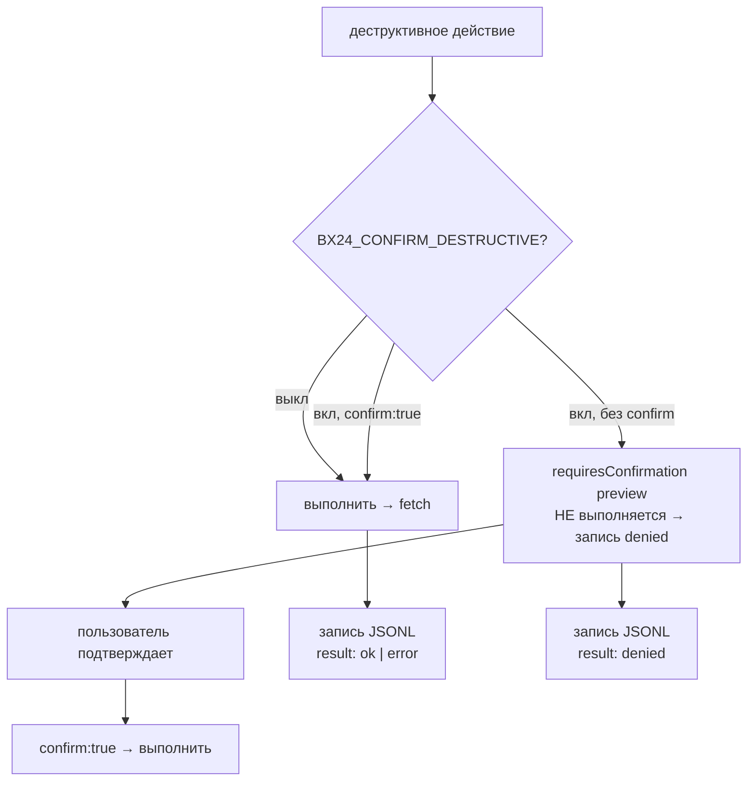

# Аудит деструктивных операций (AUDIT_LOG)

## Где живёт

Путь задаётся переменной окружения `BX24_AUDIT_LOG` (по умолчанию отключён). Рекомендуется `./audit.log` или путь в защищённом каталоге. При отсутствии переменной аудит не пишется (no-op).

## Поток аудита



## Что пишется

- Все деструктивные действия (помеченные `destructive` или содержащие ключевые слова delete/remove/complete/leave/kick/cancel/stop/close/mute/unbind/clear/markDeleted/kill) — включая отказы (`result: "denied"`), когда `BX24_CONFIRM_DESTRUCTIVE=true` и вызов пришёл без `confirm: true`.
- События авторизации: `auth.refresh` (ok/error), `auth.failed`.

## Формат — JSONL, одна строка на операцию

```json
{"ts":"2026-08-24T15:42:18.123Z","tool":"bx24_crm_companies","action":"delete","restMethod":"crm.company.delete","params":{"id":"421"},"result":"ok","durationMs":312}
{"ts":"2026-08-24T15:42:50.000Z","tool":"bx24_crm_companies","action":"delete","restMethod":"crm.company.delete","params":{"id":"421"},"result":"denied","durationMs":0}
{"ts":"2026-08-24T15:43:01.000Z","tool":"auth","action":"refresh","restMethod":"oauth/token","result":"ok"}
```

Поля:
- `ts` — ISO-8601 timestamp.
- `tool` — имя MCP-инструмента (`bx24_*`) или `auth`.
- `action` — действие (для auth — `refresh`/`failed`).
- `actor` — e-mail пользователя webhook/OAuth (если доступно; заполняется интеграцией-обёрткой при необходимости).
- `restMethod` — REST-метод Битрикс24.
- `params` — параметры вызова с маскированием секретов (ключи вида `*secret*|*token*|*password*|*webhook*` заменяются на `***`).
- `result` — `ok` | `error` | `denied`.
- `durationMs` — длительность операции.
- `requestId` — идентификатор запроса (опционально).

## Ротация и доступ

- Файл должен быть доступен только админам портала (`chmod 600`).
- Рекомендуется внешний `logrotate` или перенос в SIEM (ELK / Splunk / Sentry).
- Запись append-only (`AuditLog.write` → `appendFileSync`); ошибки записи не прерывают операцию (best-effort).

## Интеграция с SIEM (пример)

```bash
# tail-转发 в ELK через filebeat
filebeat.inputs: [{ type: log, paths: ["/var/log/bx24/audit.log"], json: { keys_under_root: true } }]
```

## Политика

- Аудит не отключаем для деструктивных операций при заданном `BX24_AUDIT_LOG`.
- Маскирование секретов обязательно (`maskParams`, `SECRET_RE`).
- При `BX24_CONFIRM_DESTRUCTIVE=true` каждое деструктивное действие: (1) первый вызов возвращает `requiresConfirmation` preview и пишется в аудит как `result: "denied"` (попытка отказа зафиксирована); (2) повтор с `confirm:true` выполняется и пишется как `ok`/`error`.