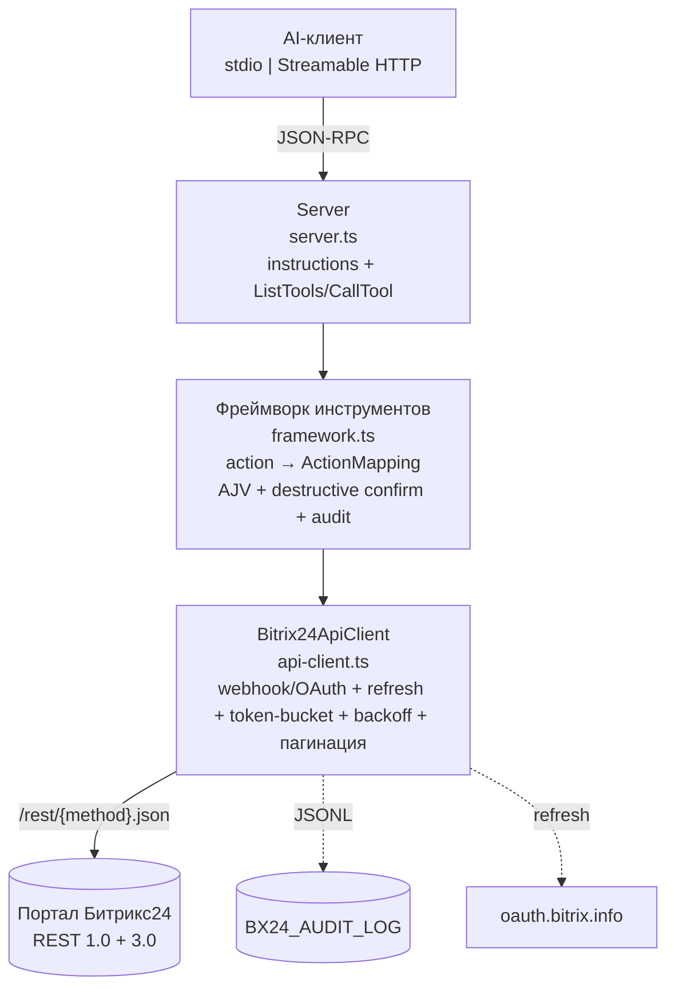
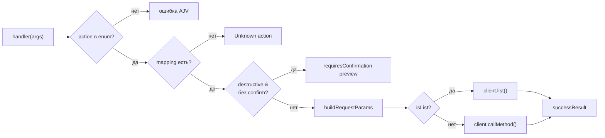
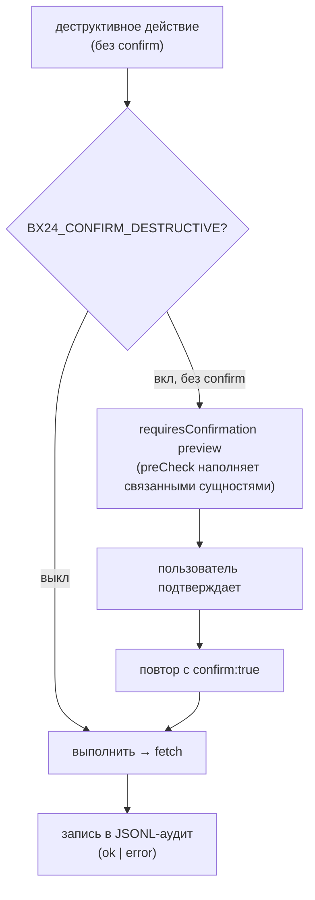

# Руководство разработчика (DEVELOPER_GUIDE)

Технический гайд для контрибьюторов и интеграторов `mcp-b24`.

## Архитектура





```
AI-клиент (stdio | Streamable HTTP)
        │ JSON-RPC
        ▼
Server (src/server.ts): instructions + ListTools/CallTool dispatch
        ▼
Tool framework (src/tools/framework.ts): action → ActionMapping, AJV, destructive confirm, audit, i18n
        ▼
Bitrix24ApiClient (src/api-client.ts): webhook/OAuth + auto-refresh + token-bucket + backoff(503/429) + pagination
        ▼
Портал Битрикс24 REST  /rest/{method}.json
```

Слои изолированы: `api-client` — только HTTP/REST; `framework` — маршрутизация action→запрос, валидация, подтверждения, аудит; инструменты — декларативные маппинги; `server` — связывание с MCP; `transport` — stdio/HTTP.

## Data-driven framework

Каждый инструмент описывается через `createActionTool(name, description, actionEnum, paramSchema, mappings, client, actionDescriptions, transformResponse?)`. `mappings` сопоставляют `action` → `ActionMapping`:

```ts
interface ActionMapping {
  restMethod: string;        // e.g. "crm.lead.add"
  httpVerb?: "GET" | "POST";
  pathParams?: string[];     // логические имена; мерджатся в тело/запрос
  queryParams?: string[];
  bodyParam?: string;        // аргумент → тело (с bodyWrapper)
  bodyWrapper?: string;      // обёртка ("fields", "users", ...)
  emptyBody?: boolean;
  rawBody?: boolean;         // все не-reserved аргументы → тело как есть
  isList?: boolean;          // вызов через client.list() с пагинацией
  destructive?: boolean;     // явный деструктивный флаг
  preCheck?: (...) => Promise<Record|undefined>;  // двухфазный preview
}
```

Правила сборки запроса: `emptyBody` → `{}`; `bodyParam` → `{[wrapper]: body}` + мердж `pathParams`; `rawBody` → все аргументы кроме `action`/`confirm`/`pathParams`; иначе `pathParams` + `queryParams`.

## Добавление нового инструмента

1. Создайте `src/tools/<group>/<entity>.ts` и опишите инструмент через `createActionTool` (шаблон — см. [crm/leads.ts](../../src/tools/crm/leads.ts)).
2. Зарегистрируйте в `src/tools/index.ts` (`getAllTools`) и обновите комментарий-счётчик группы (CRM/collab/org/biz).
3. Если `restMethod` зависит от аргумента (напр. `crm.item.*` с `entityTypeId`) — напишите кастомный инструмент с собственным `handler` (примеры: `crm/invoices.ts`, `crm/smartProcesses.ts`); для таких инструментов добавьте их action→restMethod-ожидания в `CUSTOM_EXPECTED` в `endpoint-coverage.test.ts`.
4. Поднимите ассерты счётчика инструментов в `src/tools/index.test.ts` и `src/mcp-protocol.test.ts` (`toHaveLength`).
5. `endpoint-coverage.test.ts` автоматически находит новые actions framework-инструментов, парся исходники — по-action routing-кейсы не нужны; добавьте один репрезентативный кейс в `index.test.ts` для быстрого сигнала.
6. Обновите `buildInstructions()` в `src/server.ts` и [TOOLS_REFERENCE.md](./TOOLS_REFERENCE.md) (RU + EN).

## Авторизация

- **Webhook** (`BX24_MODE=webhook` + `BX24_WEBHOOK_URL`): auth вшит в URL; токен не истекает.
- **OAuth** (`BX24_MODE=oauth` + `BX24_DOMAIN` + `BX24_CLIENT_ID/SECRET/REFRESH_TOKEN`): access_token живёт ~1ч; при `expired_token`/401 клиент делает POST на `{BX24_OAUTH_SERVER}/oauth/token/` (по умолчанию `https://oauth.bitrix.info`), сохраняет новый access/refresh и `client_endpoint`, ретраит запрос. `client_endpoint` имеет приоритет над `BX24_DOMAIN`.
- Приоритет: явный `BX24_MODE`; иначе авто-детект (вебхук, иначе OAuth).

## Rate-limit и backoff

- **Token-bucket** (`src/utils/tokenBucket.ts`): `BX24_RATE_LIMIT_RPS` (≤2 non-Enterprise, ≤5 Enterprise) + `BX24_RATE_LIMIT_BURST`.
- **503 QUERY_LIMIT_EXCEEDED**: экспоненциальный backoff 1→2→4→8→16 с, потолок 30 с (`BACKOFF_STEPS_MS`).
- **429 OPERATION_TIME_LIMIT**: пауза до `operating_reset_at` (из ответа), затем retry.
- **Batch** (`bx24_batch`): до 50 команд; учитывайте, что каждый вложенный вызов идёт в счётчик RPS.

## Деструктивные операции и аудит



- При `BX24_CONFIRM_DESTRUCTIVE=true` деструктивный action без `confirm:true` возвращает структурированный `requiresConfirmation` preview и **не выполняется**. `preCheck` (если задан) наполняет preview связанными сущностями.
- Каждое деструктивное действие пишется в `BX24_AUDIT_LOG` (JSONL) через `client.recordDestructive(...)`. Формат — см. [AUDIT_LOG.md](AUDIT_LOG.md).
- Секреты маскируются в params (`SECRET_RE`).

## Локализация

- Строки в `src/i18n/{ru,en}.ts` (тип `Dict`, parity ключей). Переключатель — `BX24_DEFAULT_LANG` (`ru`/`en`), по умолчанию `ru`.
- `t(lang, key, vars)` используется в фреймворке и api-client для сообщений.

## Тестирование (Vitest)

```bash
npm test                 # 88 тестов, 7 файлов
npm run test:coverage
```

Покрытие: `config.test`, `api-client.test` (webhook/OAuth URL, auto-refresh, client_endpoint, backoff 503, ошибки в теле 200, пагинация), `framework.test` (маршрутизация, bodyWrapper, rawBody, destructive confirm), `validate.test`, `tools/index.test` (41 инструмент + паритет action↔mapping — каждый action разрешается), `tools/endpoint-coverage.test` (парсит маппинги из исходников и инструментирует fetch для проверки всех 872 маршрутов action→REST-метод), `mcp-protocol.test` (InMemoryTransport + Client: listTools(41), вызовы).

## Сборка и публикация

```bash
npm run build        # tsc → dist/
npm version patch|minor|major
npm publish --access public   # prepublishOnly: clean → build → test
```

SemVer: MAJOR — ломающие изменения схем/переименование actions; MINOR — новые инструменты/действия; PATCH — баг-фиксы.

## Docker / CI

- Multi-stage `Dockerfile` (node:20-alpine), `docker-compose.yml` для HTTP-запуска.
- CI: lint + test + build на Node 18/20/22, релиз в npm по тегу `v*` (настраивается в GitHub Actions).

## Безопасность

- Не логируем секреты (`mask.ts`-паттерн, `SECRET_RE`).
- `.env` в `.gitignore`; не коммитьте `.env` с реальными токенами.
- `audit.log` — chmod 600, доступ только админам; рекомендована отправка в SIEM.