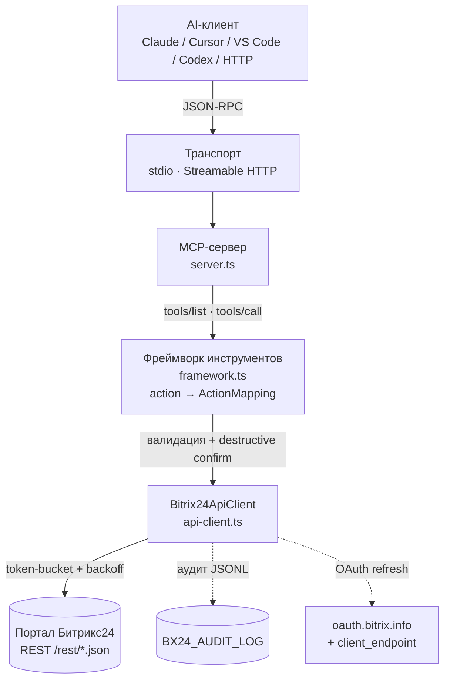

# mcp-b24 — Документация

Полный MCP-сервер над REST API Битрикс24: **30 инструментов**, ~290 действий, webhook + OAuth 2.0, RU/EN, MIT.

**Языки:** [English](../README.md) · Русский

## Архитектура



## Документация по аудиториям

| Документ | Аудитория | Назначение |
|---|---|---|
| [USER_GUIDE.md](./USER_GUIDE.md) | Обычные сотрудники | Установка, общение с AI-агентом, повседневные кейсы |
| [SELLER_GUIDE.md](./SELLER_GUIDE.md) | Менеджеры CRM / РОП / HR / админы | Роле-специфичные workflows и рецепты |
| [DEVELOPER_GUIDE.md](./DEVELOPER_GUIDE.md) | Разработчики | Архитектура, data-driven фреймворк, добавление инструментов, тесты, публикация |
| [TOOLS_REFERENCE.md](./TOOLS_REFERENCE.md) | Все | Полный реестр 30 инструментов и действий |
| [AUDIT_LOG.md](./AUDIT_LOG.md) | Админы / безопасники | Формат и политика JSONL-аудита |

Английские версии: [`en/`](../en/).

## Быстрый старт

```bash
npm install -g mcp-b24
export BX24_WEBHOOK_URL="https://ВАШ_ПОРТАЛ.bitrix24.ru/rest/1/КОД/"
npx -y mcp-b24
```

Конфиги клиентов (Claude Desktop, Cursor, VS Code, Codex CLI, Cline/Roo, Docker, HTTP) — в корневом [README](../../README.md).